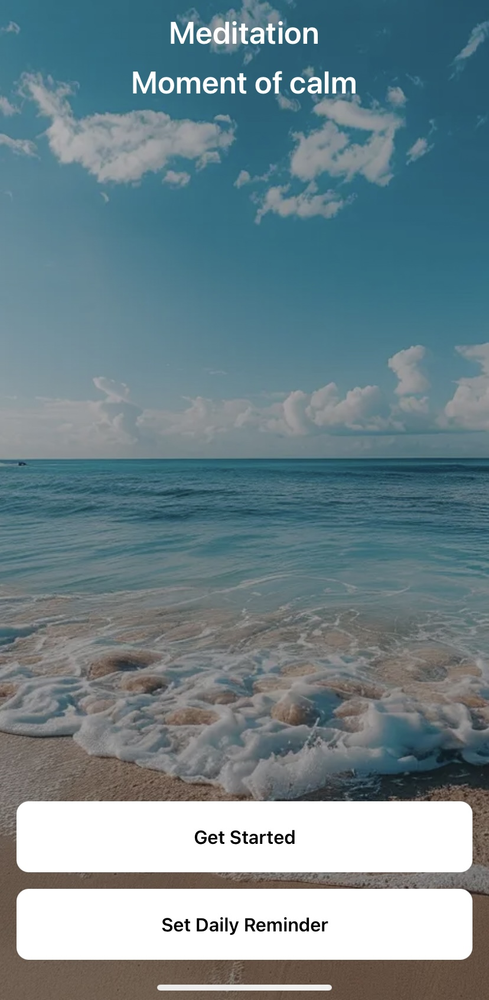
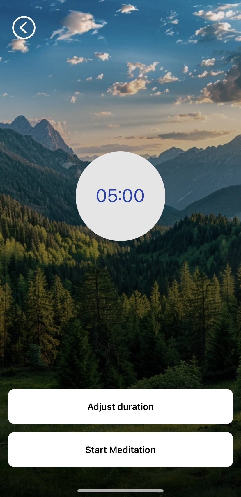
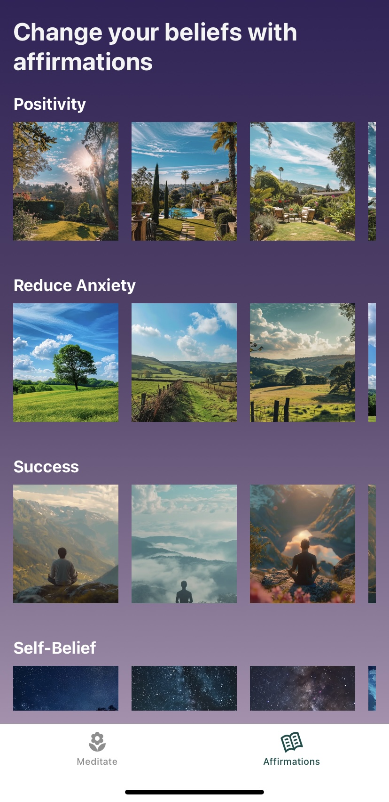

# 🌸 Meditation App

A simple and serene meditation app built with **React Native** and **Expo**.

---

## Features

- **Daily Meditation Reminder**  
  Set a custom time each day to get a gentle nudge to pause and meditate.

- **Affirmation Meditations**  
  Listen to positive affirmations designed to boost your mood and mental clarity.

- **Music Meditations**  
  Choose from a variety of ambient and relaxing sounds for your mindfulness practice.

---

## Setup Instructions

### 1. Clone the Repository

```
git clone https://github.com/KavyaMVG/Meditation-app.git
```

```
cd
```

### Install dependencies

```
npm install
```

### Start the development server

```
npx expo start
```






